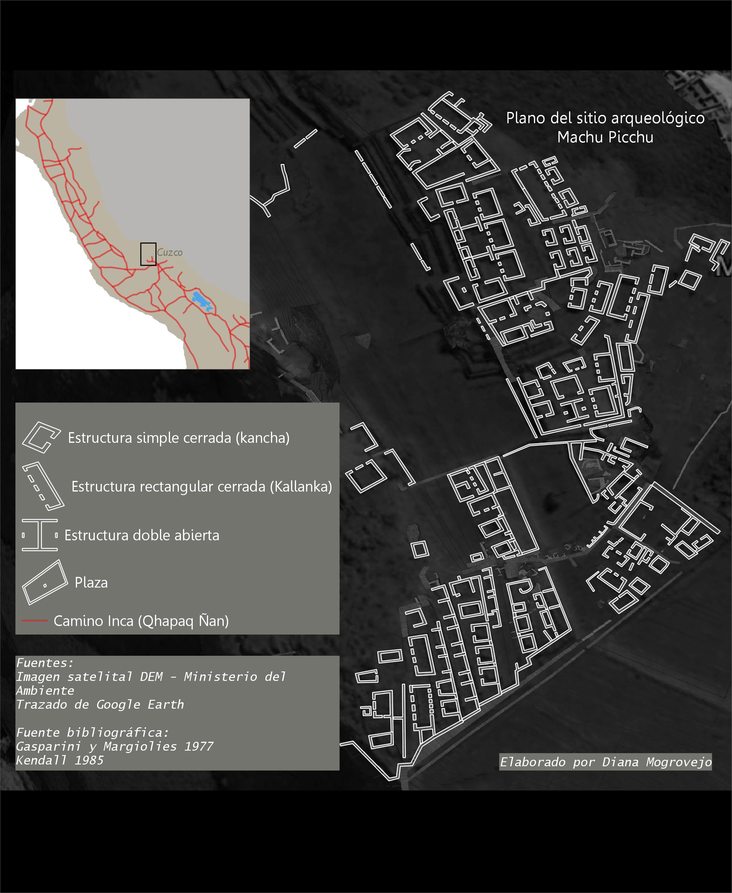
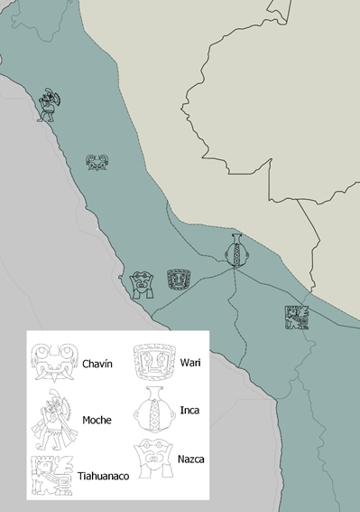
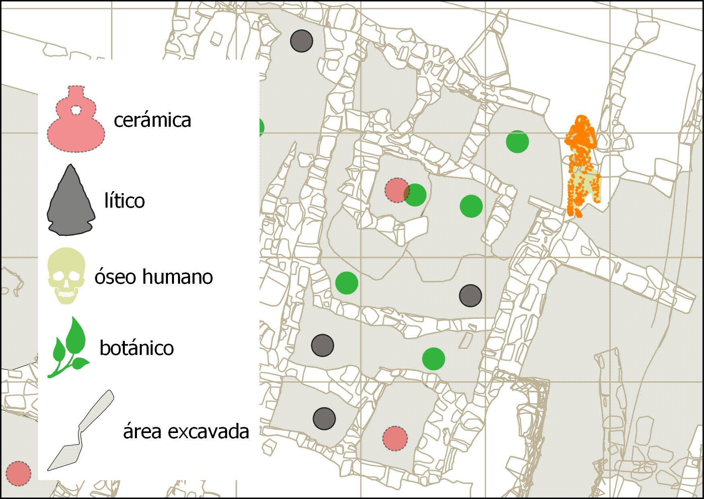

## Archaeological Patches (Peru)
This first group of patches is about prehispanic architecture remains, mainly by the time where Incas had conquered the Tawansinsuyu territory during the Late Horizon period (1478–1532 C.E).

Example 1

The second group is related to Pre-hispanic iconography and cultures which were developed in the Andean area.

Example 2

The third collection is about archaeological materials that  always is found in the field.

